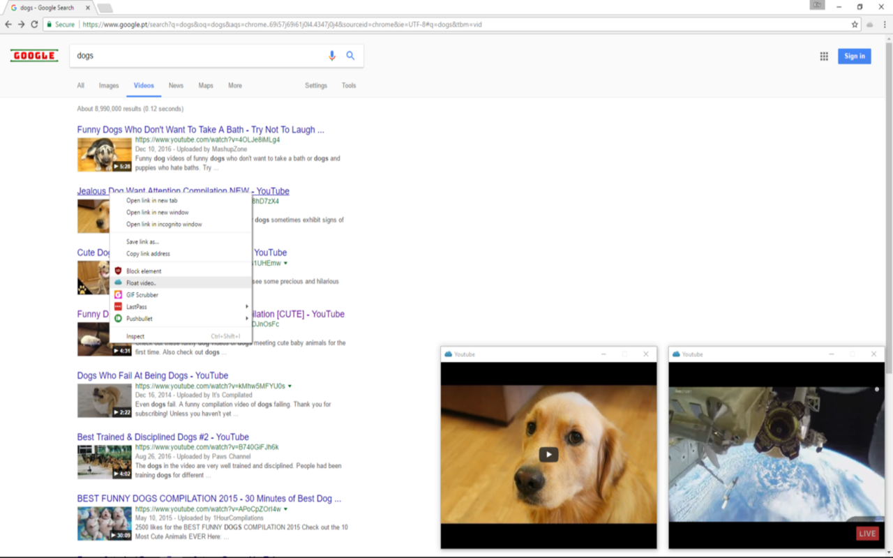

## What is it?

Fluctus consists of a web extension and a companion player app. Videos & audio are played in a floating window that is independent from the browser.

Fluctus currently supports video & audio from:
- YouTube
- Vimeo
- Twitch
- Soundcloud

 

### How to install?

#### 1. Install and run desktop player: 
  - **Windows:** [Download](https://github.com/kivS/Fluctus/releases)

  - **Linux x64:** [Download](https://github.com/kivS/Fluctus/releases)
   
   
  - **Linux x32:** [Download](https://github.com/kivS/Fluctus/releases)

#### 2. Install web extension:
  - **Chrome:** [Install](https://chrome.google.com/webstore/detail/fluctus/iadhmckmblfcoipnbjgphhmomfchpboa)
   
   
  - **Firefox:** [Install](https://github.com/kivS/Fluctus/releases)

---

Source code:
- [Chrome Extension](https://github.com/kivS/fluctus-chrome-extension)
- [Firefox Extension](https://github.com/kivS/fluctus-firefox-extension)
- [Desktop companion app](https://github.com/kivS/Fluctus)

